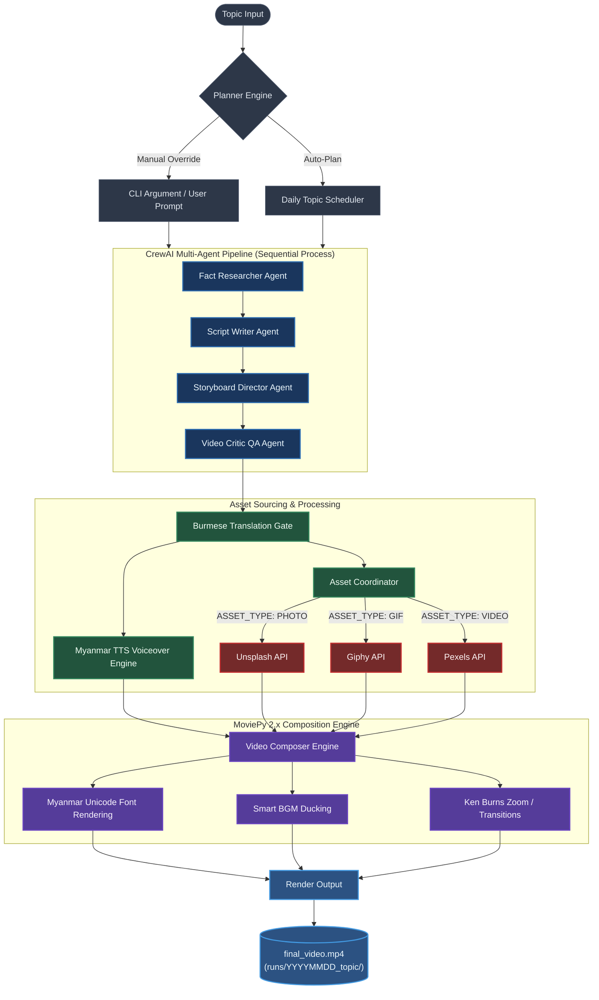

# AI Short Video Generator

An automated pipeline for generating cinematic short-form videos (TikTok, YouTube Shorts, Reels) using 100% free external stock APIs, local AI models (CrewAI), and a custom MoviePy composition engine.

## Features

- **Local & Hybrid Multi-Agent System (CrewAI):**
  - **Researcher:** Uncovers controversial or high-retention facts on any given topic.
  - **Script Writer:** Natively writes conversational Burmese scripts with raw storyteller flow, formatted with SSML pacing tags.
  - **Director:** Mathematically breaks the script timeline into sequential 3-to-5 second scenes and maps them to visual cues.
  - **Video Critic (QA Gatekeeper):** Enforces rigid structural audit on timings, asset continuity, and query intent before rendering.
- **Dynamic Curation-Driven Sourcing:**
  - Automatically queries completely free stock platforms based on the Director's storyboard:
    - `ASSET_TYPE: VIDEO` → Queries **Pexels API** for cinematic loops.
    - `ASSET_TYPE: PHOTO` → Queries **Unsplash API** for high-quality images.
    - `ASSET_TYPE: GIF` → Queries **Giphy API** for high-energy animations.
- **Cinematic MoviePy 2.x Composition Engine:**
  - **Crossfade Transitions:** Smooth 0.5s blends between scenes.
  - **Ken Burns Zoom:** Alternating zoom-in/zoom-out motion with high-fidelity LANCZOS downsampling.
  - **Smart BGM Ducking:** Vectorized audio engine that automatically ducks background music to 10% volume during spoken lines, rising back to 30% during silence.
  - **Auto-Cropping:** Crops all landscape/portrait media to a portrait 9:16 aspect ratio (1080x1920) at 30 FPS.
- **Pristine Myanmar Unicode Subtitles:**
  - **Dynamic Wrapping Subtitle Cards:** Auto-calculates text layout coordinates, wrapping lines if width > 960px, and dynamically resizes the height and width of the rounded subtitle card.
  - **Grapheme Cluster-Safe Tokenization:** Splitting text safely at phrase and base consonant boundaries, ensuring combining marks never dangle and causing **zero dotted circles** or grammar mangling.
  - **Dual-Glyph Support:** Prioritizes system fonts (`Myanmar Sangam MN`) supporting both Latin and Myanmar characters to render English words alongside Burmese with zero tofu boxes.
  - **SSML Tag Stripping:** Cleans voiceovers and subtitles of raw XML markup tags for presentation.

## Project Architecture

The following diagram illustrates the automated pipeline and orchestration flow from initial topic selection to the final rendered video composition:



## Setup

1. Clone this repository.
2. Initialize the Python virtual environment and install dependencies:
   ```bash
   python3 -m venv .venv
   source .venv/bin/activate
   pip install -r requirements.txt
   ```
3. Set up your environment variables by copying `.env.example` to `.env` and adding your free API keys:
   ```env
   # Model configurations (Qwen 2.5 local model via Ollama recommended)
   AI_MODEL=ollama/qwen2.5:14b
   WRITER_MODEL=ollama/qwen2.5:14b
   RENDER_SUBTITLES=True  # Set to False to disable on-screen overlays and generate a standalone subtitles.srt

   # Stock keys
   PEXELS_API_KEY=your-pexels-key
   UNSPLASH_API_KEY=your-unsplash-key
   GIPHY_API_KEY=your-giphy-key
   ```

## Usage

### Interactive Mode

Run the main script and enter your topic at the prompt:

```bash
python main.py
```

### Manual Override Argument (Non-Interactive)

To bypass user prompts and run the pipeline asynchronously (great for scripting and servers):

```bash
python main.py "How to spot a phishing email"
```

The output video will be generated under `runs/YYYYMMDD_[topic]/final_video.mp4`.

## Deployment & Automation Guide

### 1. Docker Setup (Containerized Execution)

Running in Docker is the most reliable way to deploy, as it packages `ffmpeg` and Noto Myanmar fonts automatically.

#### Build the Image

```bash
docker build -t ai-video-generator .
```

#### Run Container

Ensure you pass your environment variables using `-e` or an `--env-file`:

```bash
docker run --network="host" --env-file .env -v "$(pwd)/runs:/app/runs" ai-video-generator "Zero-Day Attack"
```

*Note: `--network="host"` is recommended if accessing Ollama running on `localhost:11434` outside the container.*

---

### 2. Cron Job Scheduling (Linux)

You can schedule the video generator to run on a daily schedule automatically.

#### Step 1: Create a shell runner (`run_pipeline.sh`)

Create a wrapper script to load paths and activate the virtual environment:

```bash
#!/bin/bash
cd /path/to/ai-short-video-generator
source .venv/bin/activate
export PYTHONPATH=.
python main.py >> cron_execution.log 2>&1
```

Make it executable: `chmod +x run_pipeline.sh`

#### Step 2: Add to Crontab

Open the cron scheduler:

```bash
crontab -e
```

Add a rule to run the script automatically every day at 8:00 AM:

```cron
0 8 * * * /path/to/ai-short-video-generator/run_pipeline.sh
```

---

## License

MIT
